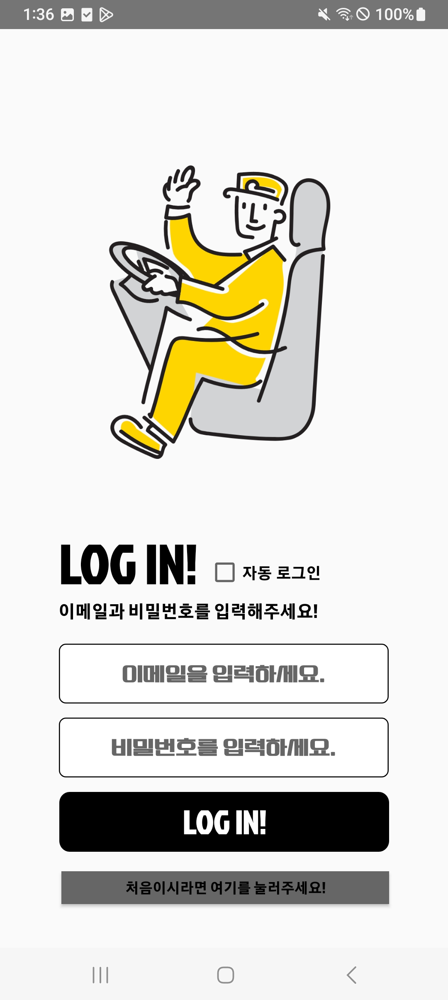
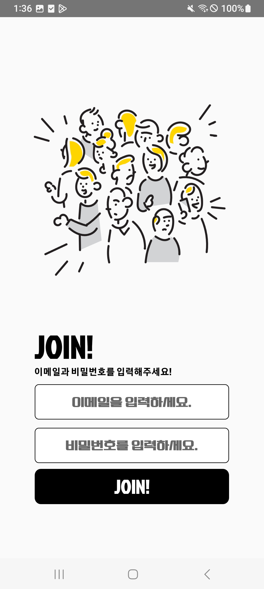
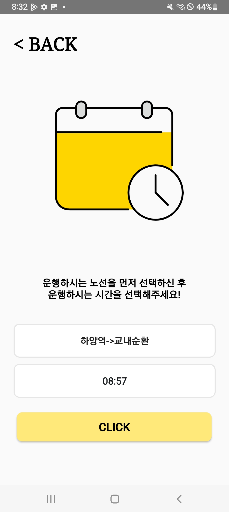
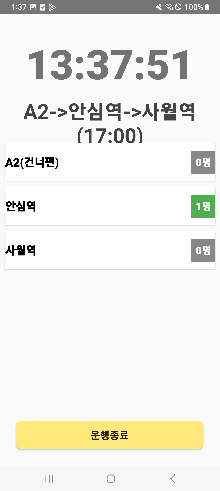
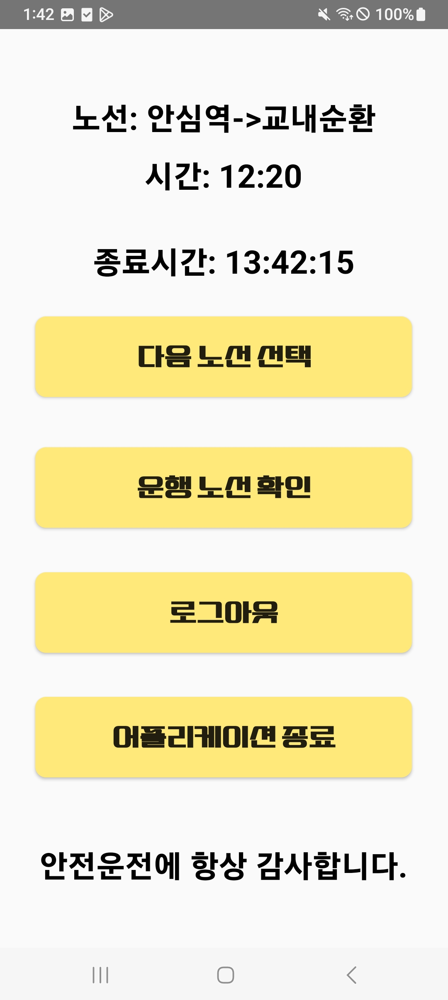
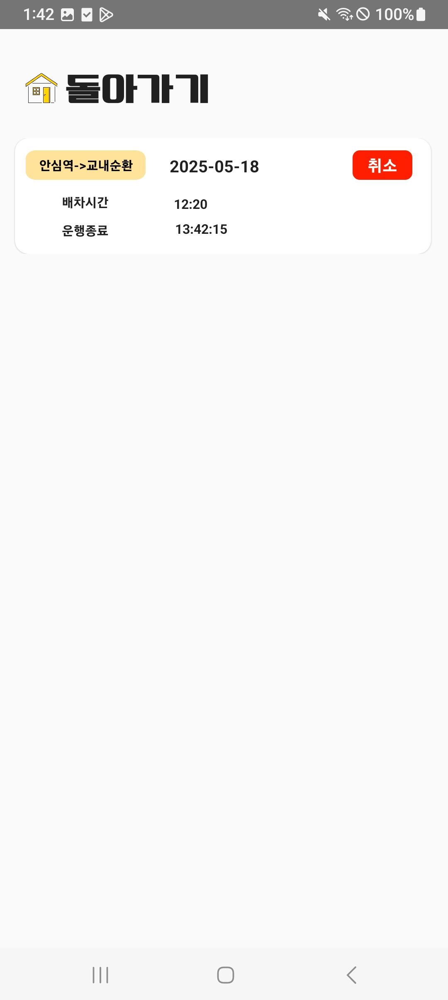

# 🚌 모교 스쿨버스 예약 시스템 운전자용 (리팩토링 버전)

- RefacSchoolBusReservationForDriver-kotlin
- 2024 대구가톨릭대학교 캡스톤디자인 🥉장려상 수상작(스쿨버스 예약 시스템) Kotlin 리팩토링 버전입니다. 

- 스쿨버스 운행을 위한 **운전자 전용 앱**입니다.  
- Firebase를 활용해 **실시간 예약자 수 조회**, **운행 기록 확인**,  
- **간편한 시간/노선 관리**가 가능한 구조로 설계되어 있습니다.
- 시연영상 보러가기 [📽️](https://youtube.com/shorts/iBq0nHXdfOc?feature=share)

---

## 주요 기능 (화면별 정리)

### 1. 로그인 [Login.kt](app/src/main/java/com/example/refac_driverapp/Login.kt) / 회원가입 화면 [Register.kt](app/src/main/java/com/example/refac_driverapp/Register.kt)
- [로그인, 회원가입](https://github.com/wonna-0830/login)

- [로그인 XML](app/src/main/res/layout/activity_login.xml)
- [회원가입 XML](app/src/main/res/layout/activity_register.xml)
- Firebase Authentication을 이용한 이메일/비밀번호 로그인
- 자동 로그인 기능 (CheckBox 클릭 시)
- 운전자 전용 계정으로 사용자와 구분 로그인 처리
- 이메일 양식이 아니거나 둘 중 하나 이상이 공란일 때 로그인 비활성화
- 이메일 양식이 아니거나 둘 중 하나 이상이 공란, 비밀번호가 8자리 미만일 시 회원가입 비활성화

---

### 2. 노선 및 시간 선택 화면 [RouteTime.kt](app/src/main/java/com/example/refac_driverapp/RouteTime.kt)
- [레이아웃](https://github.com/wonna-0830/routetime)

- [XML](app/src/main/res/layout/activity_route_time.xml)
- Spinner로 노선 선택 (운전 가능한 노선 목록 표시)
- 선택한 노선에 따라 시간 목록 자동 갱신
- 노선과 시간 둘 다 선택 시에만 확인 버튼 활성화
- 확인 버튼 클릭 시 Clock 페이지로 이동 + 선택한 노선과 시간, 날짜가 DB에 저장
- 현재 시간 기준 이후의 시간만 spinner에 반영

---

### 3. 운행 화면 [Clock.kt](app/src/main/java/com/example/refac_driverapp/Clock.kt)
- [레이아웃](https://github.com/wonna-0830/clock)

- [XML](app/src/main/res/layout/activity_clock.xml)
- 선택한 노선/시간에 따라 예약된 정류장 리스트 출력
- 각 정류장별 예약 인원 수를 실시간으로 표시 (RecyclerView 사용)
- 예약 수에 따라 뱃지 색상 자동 변경 (ex. 0명 = 회색, 다수 = 강조)
- 텍스트 크기 및 색상 최적화 (고령 운전자 고려한 UI)
- ProgressBar를 통한 로딩 상태 표시
- 시간 확인을 위한 페이지 상단 시계 기능 추가
- 운전 중 버튼 클릭 실수로 인한 페이지 이탈 방지
  - 안드로이드 기기 내 뒤로가기 버튼 실행 금지 ("운전 중에는 뒤로가기 버튼이 비활성화 됩니다" 토스트메세지 출력)
  - 운행 종료 버튼 2번 클릭해야 다음 페이지 이동

---

### 4. 운행 종료 후 화면 [Finish.kt](app/src/main/java/com/example/refac_driverapp/Finish.kt)
- [레이아웃](https://github.com/wonna-0830/finish)

- [XML](app/src/main/res/layout/activity_finish.xml)
- 해당 운전자가 운전한 노선, 시간, 운전 종료 시간 출력
- RouteTime.kt에서 저장된 DB에 종료시간(endTime)이 추가로 저장
- 다음 노선 선택, 운행 기록 확인, 로그아웃, 어플리케이션 종료 기능의 4개 버튼
- 버튼 조작 실수 방지를 위한 각각의 버튼에 AlertMessage 적용

---

### 5. 운행 기록 확인 화면 [SelectBusList.kt](app/src/main/java/com/example/refac_driverapp/SelectBusList.kt)
- [레이아웃](https://github.com/wonna-0830/selectbuslist)

- [XML](app/src/main/res/layout/activity_selectbuslist.xml)
- 해당 운전자의 과거 운행 내역 조회 (내림차순 정렬)
- RecyclerView로 기록 목록 출력
- Back 버튼 클릭 시 Finish 페이지로 이동
- 각 예약 항목에 대해 삭제 버튼 제공
  - 노선과 시간을 다르게 선택한 실수의 경우에만 삭제하도록 AlertDialog 사용
    - 운행 노선을 잘못 선택한 경우에만 삭제할 수 있습니다. 삭제된 노선에 대한 불이익은 책임지지 않습니다. 정말 삭제하시겠습니까?
- 운행 기록에 있던 정보와 똑같은 기록이 생성될 경우, 덮어쓰기를 통해 **중복 기록 방지**

---

### 6. 공통 기능
- Firebase 기반 실시간 데이터 연동
- 기기 내 뒤로가기 버튼 두번 틀릭 시 어플리케이션 종료

---

## 사용 기술

| 분류 | 기술 |
|------|------|
| 언어 | Kotlin |
| IDE | Android Studio |
| DB  | Firebase Firestore |
| 인증 | Firebase Authentication |
| 구조 | MVVM 일부 적용 (리팩토링 예정) |
| 기타 | RecyclerView, Spinner, Intent, LiveData 등 |

---

## 🔄 리팩토링 포인트
- **Java → Kotlin 전환**으로 코드 가독성 및 유지보수성 향상
- **UX 개선**
  - 운전자 연령층을 고려한 **큰 글씨 / 굵은 텍스트** 적용
  - **라이트 모드 고정**: 다크모드 미지원으로 **운전 시 안전성 확보**
  - 복잡한 조작 없이 한눈에 파악 가능한 **직관적인 UI 흐름 구성**
- **UI 개선**
  - 정류장별 예약 인원 수에 따라 **뱃지 색상 자동 변경**
  - **운행 기록 확인 페이지** 추가로 이전 예약 정보 확인 가능
- **기능 분리 구조 강화**
  - **운전자 계정 / 사용자 계정 분리**로 역할 명확화
  - **노선/시간 선택 → 예약현황 확인**까지 단순한 흐름 구현

---

> 📌 앱 UI 및 시연 영상은 추후 업데이트 예정입니다.
>  
> ✨ 이 앱은 사용자 앱과 실시간으로 연동되며, 효율적인 스쿨버스 운행을 위한 도구로 설계되었습니다.
